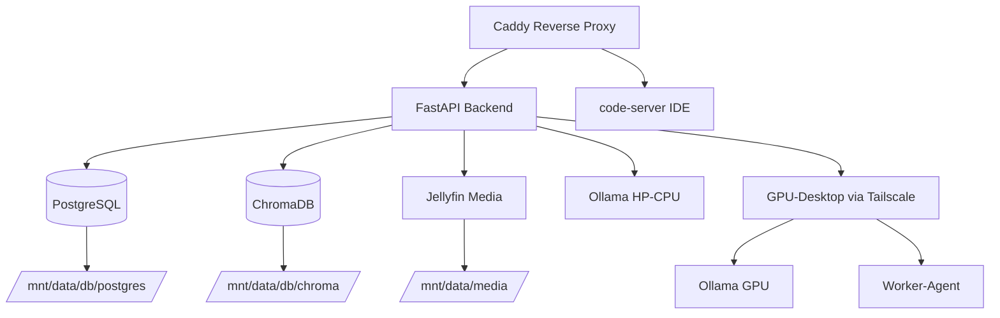

# Architekturübersicht — Homelab-Imperium („HomeOS")

> **Dokumentenversion:** 1.0  
> **Autor:** Senior Enterprise Architect  
> **Stand:** 26. Juni 2026  
> **Klassifizierung:** Intern — Technische Referenzarchitektur

---

## Inhaltsverzeichnis

1. [Architekturphilosophie & Designprinzipien](#1-architekturphilosophie--designprinzipien)
2. [Die 3-Layer-Architektur im Überblick](#2-die-3-layer-architektur-im-überblick)
3. [Layer 1: Hardware Interaction Layer](#3-layer-1-hardware-interaction-layer)
4. [Layer 2: Business Logic Layer](#4-layer-2-business-logic-layer)
5. [Layer 3: Frontend Layer](#5-layer-3-frontend-layer)
6. [Datenfluss-Tabellen](#6-datenfluss-tabellen)
7. [API-Wrapper-Prinzip & iFrame-Sicherheitsarchitektur](#7-api-wrapper-prinzip--iframe-sicherheitsarchitektur)
8. [ASCII-Datenflussdiagramme](#8-ascii-datenflussdiagramme)
9. [Sicherheitsarchitektur (Ghost-Server-Konzept)](#9-sicherheitsarchitektur-ghost-server-konzept)
10. [Infrastruktur-Übersicht (Docker Compose)](#10-infrastruktur-übersicht-docker-compose)

---

## 1. Architekturphilosophie & Designprinzipien

Das Homelab-Imperium (Codename „HomeOS") folgt einer strengen **3-Layer-Architektur** mit
klar definierten Verantwortlichkeitsgrenzen. Die Architektur ist nach folgenden
Leitprinzipien entworfen:

| Prinzip | Beschreibung |
|---|---|
| **API-Wrapper-Mandat** | Kein Frontend-Code darf direkt mit Drittanbieter-Diensten (Jellyfin, Ollama, ChromaDB) kommunizieren. Jede Interaktion läuft zwingend über das FastAPI-Backend. |
| **iFrame-Isolationsrichtlinie** | Das Einbetten fremder iFrames (Jellyfin-UI, externe Dashboards) ist im Frontend architektonisch unterbunden. Einzige Ausnahme: der code-server (`/ide/*`) als vertrauenswürdige Entwicklungsumgebung. |
| **Separation of Concerns** | Router (`routers/`) sind dünn und ausschließlich für HTTP-Belange zuständig. Geschäftslogik residiert in `services/`. Infrastruktur-Clients residieren in `services/clients/`. |
| **Defense in Depth** | Jede Schicht enthält eigene Sicherheitsmechanismen: Pfad-Traversal-Schutz in `files.py`, Authentifizierungs-Proxying in Caddy, Container-Isolation via Docker. |
| **Graceful Degradation** | Der `OllamaSmartRouter` fällt bei GPU-Ausfall automatisch auf die lokale CPU-Inferenz zurück. Kein Dienst hat einen Single Point of Failure ohne Fallback. |

---

## 2. Die 3-Layer-Architektur im Überblick

```
┌─────────────────────────────────────────────────────────────────────┐
│                     LAYER 3: FRONTEND LAYER                          │
│  ┌──────────┐  ┌──────────┐  ┌──────────┐  ┌──────────────────────┐ │
│  │ index.html│  │ api.js   │  │router.js │  │ views/ (10 Module)   │ │
│  │ SPA-Shell │  │ Fetch-   │  │ Hash-    │  │ dashboard, media,    │ │
│  │           │  │ Wrapper  │  │ Router   │  │ files, finance,      │ │
│  │           │  │ /api/*   │  │ #/...    │  │ health, school, auto, │ │
│  │           │  │          │  │          │  │ code, music, ai_chat │ │
│  └──────────┘  └──────────┘  └──────────┘  └──────────────────────┘ │
│                                                                      │
│  ⚠ KEINE direkten iFrames (außer code-server)                       │
│  ⚠ KEINE direkten API-Calls an Drittanbieter                         │
└────────────────────────────┬────────────────────────────────────────┘
                             │  HTTPS (Caddy reverse proxy)
                             │  /api/* → fastapi_app:8000
                             │  /ide/* → code_server:8080
                             │  /*     → Static Files
                             ▼
┌─────────────────────────────────────────────────────────────────────┐
│                   LAYER 2: BUSINESS LOGIC LAYER                      │
│                                                                      │
│  ┌───────────────────────┐  ┌──────────────────────────────────────┐ │
│  │  routers/ (10 Module) │  │  services/ (10 Module)               │ │
│  │  ┌──────────────────┐ │  │  ┌────────────────────────────────┐  │ │
│  │  │ ai.py → AI Chat  │ │  │  │ ollama_router.py               │  │ │
│  │  │ auto.py → KFZ    │ │  │  │   └─ OllamaSmartRouter         │  │ │
│  │  │ code.py → Sandbox│ │  │  │      (HP-CPU ↔ GPU-Desktop)    │  │ │
│  │  │ files.py → Daten │ │  │  │ rag_engine.py                  │  │ │
│  │  │ finance.py → €   │ │  │  │   └─ PDF→Chunks→ChromaDB       │  │ │
│  │  │ health_bio.py    │ │  │  │ media.py → Jellyfin-Wrapper    │  │ │
│  │  │ health.py        │ │  │  │ files.py → Pfadsicherheit      │  │ │
│  │  │ ide.py → Proxy   │ │  │  │ ide.py → Container-Management  │  │ │
│  │  │ media.py → Stream│ │  │  │ auto.py → 3D/OpenSCAD          │  │ │
│  │  │ music.py → Audio │ │  │  │ ...                             │  │ │
│  │  │ school.py → LMS  │ │  │  └────────────────────────────────┘  │ │
│  │  │ system.py        │ │  │                                      │ │
│  │  └──────────────────┘ │  │  ┌────────────────────────────────┐  │ │
│  │  Dünn, HTTP-only      │  │  │  services/clients/             │  │ │
│  │  Delegieren an        │  │  │  ├─ jellyfin.py                │  │ │
│  │  services/            │  │  │  ├─ ollama.py                  │  │ │
│  └───────────────────────┘  │  │  └─ chroma.py                  │  │ │
│                              │  └────────────────────────────────┘  │ │
│  ┌───────────────────────┐  │                                      │ │
│  │  database.py          │  │  ┌────────────────────────────────┐  │ │
│  │  models.py (ORM)      │  │  │  worker_client.py              │  │ │
│  │  schemas.py (Pydantic)│  │  │  → Remote GPU-Desktop Agent    │  │ │
│  │  config.py (Settings) │  │  └────────────────────────────────┘  │ │
│  └───────────────────────┘  └──────────────────────────────────────┘ │
└────────────────────────────┬────────────────────────────────────────┘
                             │  Interne Docker-Netzwerk-Kommunikation
                             │  PostgreSQL:5432, ChromaDB:8000
                             │  Ollama:11434, Jellyfin:8096
                             ▼
┌─────────────────────────────────────────────────────────────────────┐
│                LAYER 1: HARDWARE INTERACTION LAYER                   │
│                                                                      │
│  ┌──────────┐ ┌──────────┐ ┌──────────┐ ┌──────────┐ ┌──────────┐  │
│  │PostgreSQL│ │ ChromaDB │ │ Jellyfin │ │  Ollama  │ │  Caddy   │  │
│  │  :5432   │ │  :8000   │ │  :8096   │ │ :11434   │ │ :80/:443 │  │
│  │  (SQL)   │ │(Vektor-DB)│ │ (Media)  │ │ (LLM)    │ │(Reverse  │  │
│  │          │ │          │ │          │ │          │ │ Proxy)   │  │
│  └──────────┘ └──────────┘ └──────────┘ └──────────┘ └──────────┘  │
│                                                                      │
│  ┌──────────────────────────────────────────────────────────────┐   │
│  │  Externer GPU-Desktop (Tailscale-Mesh)                        │   │
│  │  ┌──────────┐  ┌──────────────────┐                          │   │
│  │  │  Ollama  │  │  Worker-Agent    │                          │   │
│  │  │ :11434   │  │  (OpenSCAD/CAD)  │                          │   │
│  │  └──────────┘  └──────────────────┘                          │   │
│  └──────────────────────────────────────────────────────────────┘   │
│                                                                      │
│  ┌──────────────────────────────────────────────────────────────┐   │
│  │  Persistenter Speicher: /mnt/data/                            │   │
│  │  ├── db/         (PostgreSQL + ChromaDB)                      │   │
│  │  ├── media/      (Jellyfin-Bibliothek, Musik)                 │   │
│  │  ├── files/      (Dokumente, PDFs, Uploads)                   │   │
│  │  └── ai_models/  (Ollama-Modelle)                             │   │
│  └──────────────────────────────────────────────────────────────┘   │
└─────────────────────────────────────────────────────────────────────┘
```

---

## 3. Layer 1: Hardware Interaction Layer

Der Hardware Interaction Layer umfasst alle infrastrukturellen Dienste, die als
Docker-Container betrieben werden. Dieser Layer stellt die persistente Datenhaltung
und die externen Schnittstellen (LLM-Inferenz, Medienserver) bereit.

### 3.1 Container-Übersicht

| Container | Image | Port | Aufgabe | Persistenz |
|---|---|---|---|---|
| `imperium_proxy` | `caddy:latest` | 80, 443 | TLS-Terminierung, Reverse Proxy, Statisches File-Hosting | `/mnt/data/caddy_data` |
| `imperium_backend` | Custom (FastAPI) | 8000 (intern) | API-Wrapper, Geschäftslogik, ORM | `/mnt/data` (Mount) |
| `imperium_postgres` | `postgres:15-alpine` | 5432 (intern) | Relationale Datenbank (Finanzen, Gesundheit, Schule, Fahrzeuge) | `/mnt/data/db/postgres` |
| `imperium_chroma` | `chromadb/chroma:latest` | 8000 (intern) | Vektordatenbank (RAG Embeddings, PDF-Indizierung) | `/mnt/data/db/chroma` |
| `imperium_jellyfin` | `jellyfin/jellyfin:latest` | 8096 (intern) | Medienstreaming & -transcoding | `/mnt/data/media` |

### 3.2 Externer GPU-Desktop (Tailscale-Mesh)

Der Desktop-PC mit NVIDIA GTX 1060 wird über das Tailscale-Mesh-Netzwerk
(`desktop-pc-tailscale`) angebunden. Er hostet:

- **Ollama** auf Port `11434` für GPU-beschleunigte LLM-Inferenz
- **Worker-Agent** für rechenintensive CAD/OpenSCAD-Renderaufgaben

Die Verbindung erfolgt ausschließlich über das verschlüsselte Tailscale-Netz;
eine direkte Exposition ins LAN findet nicht statt.

### 3.3 Persistenz-Strategie

Sämtliche Daten liegen auf dem gemounteten Volume `/mnt/data` der HDD. Die
Verzeichnisstruktur:

```
/mnt/data/
├── db/
│   ├── postgres/   ← PostgreSQL-Datenbankdateien
│   └── chroma/     ← ChromaDB-Vektorindizes
├── media/          ← Jellyfin-Medienbibliothek (Filme, Serien, Musik)
├── files/          ← Nutzerdokumente, Schul-PDFs, Uploads
├── ai_models/      ← Ollama-Modelle (qwen2.5-coder, llama3, nomic-embed-text)
├── caddy_data/     ← Caddy TLS-Zertifikate & Konfiguration
└── caddy_config/   ← Caddy Runtime-Konfiguration
```

---

## 4. Layer 2: Business Logic Layer

Der Business Logic Layer ist das Herzstück des Homelab-Imperiums. Er implementiert
das **API-Wrapper-Prinzip** und besteht aus drei hierarchischen Sub-Layern.

### 4.1 Router-Schicht (`routers/`)

Die Router sind **ausschließlich** für HTTP-Belange zuständig: Sie empfangen Requests,
delegieren an Services und serialisieren Responses. Sie enthalten **keine**
Geschäftslogik.

| Router | Endpunkte (Auszug) | Delegiert an |
|---|---|---|
| `ai.py` | `POST /api/ai/chat` | `services/ollama_router.py` |
| `auto.py` | `GET /api/auto/vehicles`, `POST /api/auto/repair` | `services/auto.py` |
| `code.py` | `POST /api/code/execute` | `services/code.py` |
| `files.py` | `GET /api/files/list`, `POST /api/files/upload` | `services/files.py` |
| `finance.py` | `GET /api/finance/transactions`, `POST /api/finance/transactions` | `services/finance.py` |
| `health_bio.py` | `POST /api/health/records` | `services/health_bio.py` |
| `health.py` | `GET /api/health/dashboard` | `services/health_bio.py` |
| `ide.py` | `GET /api/ide/session` | `services/ide.py` |
| `media.py` | `GET /api/media/library`, `GET /api/media/playback/{id}` | `services/media.py` |
| `music.py` | `GET /api/music/artists` | `services/music.py` |
| `school.py` | `GET /api/school/subjects` | `services/school.py` |
| `system.py` | `GET /api/system/metrics` | `services/system.py` |

### 4.2 Service-Schicht (`services/`)

Die Services implementieren die gesamte Geschäftslogik. Sie sind zustandslos
und werden von den Routern per Dependency Injection eingebunden.

| Service | Kernfunktion |
|---|---|
| `ollama_router.py` | `OllamaSmartRouter`: Dynamisches Last-Routing zwischen HP-CPU und GPU-Desktop. Power-Mode-Erkennung, Ping-basiertes Failover. |
| `rag_engine.py` | `RAGEngine`: PDF-Text-Extraktion → Embedding-Generierung via Ollama (`nomic-embed-text`) → Speicherung in ChromaDB → Kontext-Retrieval für Prompts |
| `media.py` | `MediaService`: Kapselt die Jellyfin-API. Transformiert Jellyfin-Metadaten ins HomeOS-Format. Erzeugt Direct-Play/Transcode-Stream-URLs. |
| `files.py` | `FileBunkerService`: Pfadsicherheit via `secure_path()` (Traversal-Schutz). Datei-Listing, Upload, Download. |
| `finance.py` | Berechnung von Budget-Trends, Monatsaggregation, Ausgabenkategorisierung. |
| `health_bio.py` | Analyse von Vitaldaten (Gewicht, KFA, Kalorien), Mahlzeiten-Tracking, 3D-Symptom-Mapping auf das SVG-Hologramm. |
| `school.py` | Lernfortschritt-Analyse, PDF-Skript-Parsing, Notendurchschnitt-Berechnung. |
| `auto.py` | Fahrzeugdaten-CRUD, OpenSCAD-Code-Generierung, Render-Job-Delegation an Worker. |
| `code.py` | Python-Code-Validierung, isolierte Container-Ausführung (Sandboxing). |
| `music.py` | MP3-ID3-Tag-Parsing, Cover-Art-Extraktion, lokale Musikindexierung. |
| `ide.py` | `WebIDEManagerService`: Docker-Container-Health-Checks für code-server, Session-Management. |
| `system.py` | Systemmetriken: CPU, RAM, Festplatte, Uptime via `psutil`. |
| `worker_client.py` | Netzwerk-Client für den GPU-Desktop-Worker-Agenten (CAD-Rendering). |

### 4.3 Client-Schicht (`services/clients/`)

Die Clients sind minimalistische Wrapper für externe APIs. Sie enthalten **ausschließlich**
Netzwerklogik, keine Geschäftslogik.

| Client | Wrapped API | Methode |
|---|---|---|
| `jellyfin.py` | Jellyfin REST API | `get_movies()`, `get_series()`, `get_playback_url()` |
| `ollama.py` | Ollama REST API | `generate()`, `ping()`, `list_models()` |
| `chroma.py` | ChromaDB HTTP API | `create_collection()`, `add_embeddings()`, `query()` |

### 4.4 Datenmodelle (`models.py`)

PostgreSQL-Datenbanktabellen via SQLAlchemy ORM:

| Modell | Tabelle | Felder (Auszug) |
|---|---|---|
| `Transaction` | `transactions` | `id`, `amount`, `category`, `is_expense`, `timestamp` |
| `HealthRecord` | `health_records` | `id`, `record_type`, `val1`, `val2`, `symptom_location`, `timestamp` |
| `SchoolSubject` | `school_subjects` | `id`, `name`, `teacher` → `grades` (Relationship) |
| `SchoolGrade` | `school_grades` | `id`, `subject_id` (FK), `value`, `weight` |
| `Vehicle` | `vehicles` | `id`, `name`, `vehicle_type`, `odometer_km`, `is_damaged`, `damaged_parts_json` |

### 4.5 Validierung (`schemas.py`)

Pydantic-Modelle für Request-Validierung und Response-Serialisierung:

| Schema | Verwendung |
|---|---|
| `ChatRequest` | Eingehende KI-Chat-Anfragen: `agent_name`, `prompt`, `power_mode`, `rag_enabled` |
| `ChatResponse` | Ausgehende KI-Antworten mit Metriken: `backend_used`, `model`, `execution_time_ms`, `tokens_per_second` |
| `TransactionCreate` / `TransactionResponse` | CRUD für Finanztransaktionen |
| `HealthRecordCreate` / `HealthRecordResponse` | CRUD für Gesundheitsdaten |
| `VehicleResponse` | Fahrzeugdaten-Transfer |
| `SystemMetricResponse` | Systemmonitoring-Daten |

---

## 5. Layer 3: Frontend Layer

Der Frontend Layer ist eine **Single-Page Application (SPA)** ohne Framework-Abhängigkeiten.
Er besteht aus reinem Vanilla JavaScript (ES Modules), CSS und HTML.

### 5.1 Komponenten-Architektur

```
frontend/static/
├── index.html              ← SPA-Shell: Navigation, Viewport, CSS-Imports
├── styles/
│   ├── tokens.css          ← Design-Tokens: Glass-Effekte, Neon-Glows, Farbpalette
│   └── main.css            ← Layout: Sidebar, Grid, Responsive Breakpoints
└── js/
    ├── api.js              ← Zentraler HTTP-Client: Fetch-Wrapper, /api/* Basis-URL
    ├── router.js           ← Hash-Router: #/dashboard, #/media, #/files, …
    └── views/
        ├── dashboard.js    ← Systemmetriken, Modul-Übersicht, Quick-Actions
        ├── ai_chat.js      ← Multi-Agenten Chat (4 parallele Agenten-Interfaces)
        ├── auto.js         ← Fahrzeug-Management mit SVG-Komponente
        ├── code.js         ← Code-Editor mit KI-Assistent
        ├── files.js        ← Dateimanager mit Drag-and-Drop
        ├── finance.js      ← Finanz-Dashboard, Ausgabendiagramme
        ├── health.js       ← Gesundheits-Tagebuch, 3D-SVG-Körper-Hologramm
        ├── media.js        ← HTML5-Videoplayer, Medienbibliothek
        ├── music.js        ← Audio-Player für lokale MP3-Sammlung
        └── school.js       ← Notenspiegel, Agenda, PDF-Upload
```

### 5.2 Routing-Mechanismus

Der `router.js` implementiert einen **Hash-basierten Client-Router**:

```
URL: https://hp-server.tailscale-mesh.net/#/media
                                                ├── Hash wird vom Router gelesen
                                                ├── showMedia() wird aufgerufen
                                                └── View wird in <div id="view-port"> gerendert
```

**Route-Tabelle:**

| Hash | View-Funktion | Modul |
|---|---|---|
| `#/dashboard` | `showDashboard()` | Systemübersicht |
| `#/media` | `showMedia()` | Medienplayer |
| `#/files` | `showFiles()` | Dateimanager |
| `#/finance` | `showFinance()` | Finanzen |
| `#/health` | `showHealth()` | Gesundheit |
| `#/school` | `showSchool()` | Schule |
| `#/auto` | `showAuto()` | Fahrzeuge |
| `#/code` | `showCode()` | Code-Editor |
| `#/music` | `showMusic()` | Musik |
| `#/ai-studio` | `showAIChat()` | KI-Studio |

### 5.3 API-Kommunikation (`api.js`)

Der zentrale `apiRequest()`-Wrapper erzwingt:

- **Basis-URL**: Alle Requests gehen an `/api/*` (Caddy leitet an FastAPI weiter)
- **Content-Type**: Standardmäßig `application/json`
- **Fehlerbehandlung**: Zentrales Error-Logging

```javascript
// Beispiel: Frontend fragt Medienbibliothek an
const movies = await apiRequest("/media/library");
// → GET /api/media/library → Caddy → FastAPI → MediaService → JellyfinClient
```

---

## 6. Datenfluss-Tabellen

### 6.1 Medien-Wiedergabe (API-Wrapper-Prinzip in Aktion)

| Schritt | Von | Nach | Aktion | Protokoll |
|---|---|---|---|---|
| 1 | Browser | Caddy `:443` | `GET /api/media/library` | HTTPS |
| 2 | Caddy | FastAPI `:8000` | Reverse Proxy `/api/*` → `fastapi_app` | HTTP (intern) |
| 3 | `routers/media.py` | `services/media.py` | `MediaService.fetch_dashboard_movies()` | Python-Funktionsaufruf |
| 4 | `services/media.py` | `clients/jellyfin.py` | `JellyfinClientWrapper.get_movies()` | Python-Funktionsaufruf |
| 5 | `clients/jellyfin.py` | Jellyfin `:8096` | `GET /Items?IncludeItemTypes=Movie` | HTTP (intern) |
| 6 | Jellyfin `:8096` | `clients/jellyfin.py` | JSON: Filmdaten (Id, Name, ImageTags, …) | HTTP Response |
| 7 | `clients/jellyfin.py` | `services/media.py` | Rohdaten (Dict) | Rückgabewert |
| 8 | `services/media.py` | `routers/media.py` | Transformiertes HomeOS-Format: `[{id, title, type, cover_url}]` | Rückgabewert |
| 9 | `routers/media.py` | FastAPI Response | JSON-Response | HTTP |
| 10 | Caddy | Browser | JSON-Response (TLS-gesichert) | HTTPS |

⚠ **Kritisch:** Schritt 4–5 erfolgt **ausschließlich** im Backend. Das Frontend erhält zu keinem Zeitpunkt eine Jellyfin-URL. Die `cover_url` zeigt auf `/api/media/cover/{id}`, was einen weiteren Backend-Proxy-Durchlauf auslöst und das Jellyfin-Originalbild ausliefert.

### 6.2 KI-Chat mit RAG (Vollständiger Pfad)

| Schritt | Von | Nach | Aktion |
|---|---|---|---|
| 1 | Browser | Caddy `:443` | `POST /api/ai/chat` → `{agent_name, prompt, power_mode, rag_enabled}` |
| 2 | Caddy | FastAPI `:8000` | Reverse Proxy |
| 3 | `routers/ai.py` | `schemas.py` | Pydantic-Validierung → `ChatRequest` |
| 4 | `routers/ai.py` | `services/rag_engine.py` | `RAGEngine.retrieve_context(query)` (wenn `rag_enabled=true`) |
| 5 | `services/rag_engine.py` | `clients/chroma.py` | `ChromaDBWrapper.query()` → Embedding-Suche |
| 6 | `clients/chroma.py` | ChromaDB `:8000` | Vector Similarity Search |
| 7 | `routers/ai.py` | `services/ollama_router.py` | `OllamaSmartRouter.route_prompt(prompt, system_prompt, power_mode)` |
| 8 | `services/ollama_router.py` | `clients/ollama.py` (lokal/remote) | `OllamaClientWrapper.generate()` |
| 9 | `clients/ollama.py` | Ollama `:11434` | `POST /api/generate` → LLM-Inferenz |
| 10 | Ollama | Browser | Streaming-Response via FastAPI → Caddy → Client |

### 6.3 Datei-Upload mit Pfadsicherheit

| Schritt | Von | Nach | Aktion |
|---|---|---|---|
| 1 | Browser | Caddy `:443` | `POST /api/files/upload` (Multipart) |
| 2 | Caddy | FastAPI `:8000` | Proxy |
| 3 | `routers/files.py` | `services/files.py` | `FileBunkerService.secure_path(relative_path)` |
| 4 | `services/files.py` | — | `os.path.abspath()` → Traversal-Prüfung (`..`-Erkennung) |
| 5 | — | — | Bei Verstoß: `PermissionError` → `403 Forbidden` |
| 6 | — | — | Bei Erfolg: Datei wird unter `/mnt/data/files/` gespeichert |

### 6.4 code-server IDE (Einzige iFrame-Ausnahme)

| Schritt | Von | Nach | Aktion |
|---|---|---|---|
| 1 | Browser | Caddy `:443` | `GET /api/ide/session` |
| 2 | Caddy | FastAPI `:8000` | Proxy `/api/*` |
| 3 | `routers/ide.py` | `services/ide.py` | `WebIDEManagerService.is_ide_container_healthy()` |
| 4 | FastAPI | Browser | HTML mit `<iframe src="/ide/">` |
| 5 | Browser | Caddy `:443` | iframe lädt `GET /ide/` |
| 6 | Caddy | code-server `:8080` | Proxy `/ide/*` → `code_server:8080` |
| 7 | code-server | Browser | VS Code Web-Interface (innerhalb des iframes) |

---

## 7. API-Wrapper-Prinzip & iFrame-Sicherheitsarchitektur

### 7.1 Das API-Wrapper-Prinzip

Das Homelab-Imperium setzt das API-Wrapper-Prinzip als **architektonisches Grundgesetz**
durch. Kein einziger Frontend-Code (`frontend/static/js/`) darf eine direkte HTTP-Verbindung
zu einem Drittanbieter-Dienst aufbauen.

**Verbotene Kommunikationsmuster:**

```
❌ Browser ──HTTP──▶ Jellyfin:8096         (Direkter API-Zugriff)
❌ Browser ──HTTP──▶ ChromaDB:8000         (Direkter Vektor-DB-Zugriff)
❌ Browser ──HTTP──▶ Ollama:11434          (Direkte LLM-Inferenz)
❌ <iframe src="http://jellyfin:8096">     (Eingebettete Drittanbieter-UI)
❌ <iframe src="http://chromadb:8000">     (Eingebettete Admin-UI)
```

**Erzwungene Kommunikationsmuster:**

```
✅ Browser ──HTTPS──▶ Caddy:443 ──▶ FastAPI:8000 ──▶ Jellyfin:8096
✅ Browser ──HTTPS──▶ Caddy:443 ──▶ FastAPI:8000 ──▶ ChromaDB:8000
✅ Browser ──HTTPS──▶ Caddy:443 ──▶ FastAPI:8000 ──▶ Ollama:11434
✅ <iframe src="/ide/">  ──▶ Caddy ──▶ code-server:8080  (Einzige Ausnahme)
```

### 7.2 iFrame-Isolationsrichtlinie

Das Frontend ist so konzipiert, dass Drittanbieter-iFrames **architektonisch unmöglich**
sind. Die Gründe:

| Grund | Erläuterung |
|---|---|
| **Content Security Policy** | Geplant: `Content-Security-Policy: frame-src 'self'` im Caddyfile — blockiert alle fremden Frame-Quellen. |
| **Keine direkten URLs** | Die `services/`-Schicht liefert niemals Drittanbieter-URLs an das Frontend aus. Cover-URLs, Stream-URLs — alles läuft durch `/api/*`. |
| **Caddy-Routing** | Nur `/api/*` und `/ide/*` werden an Backend-Dienste geroutet. Alle anderen Pfade werden als statische Dateien behandelt oder fallen ins Leere. |
| **Architektur-Review** | Der `project-manifest.json` listet keinen einzigen View auf, der iFrames einbettet. |

### 7.3 Die eine Ausnahme: code-server

Der code-server (`/ide/*`) ist die **einzige** autorisierte iFrame-Einbettung im
gesamten System. Die Rechtfertigung:

1. **Vertrauenswürdigkeit**: code-server ist ein selbst gehosteter, containerisierter Dienst unter voller administrativer Kontrolle.
2. **Proxying**: Der Zugriff erfolgt über Caddy (`/ide/* → code_server:8080`), niemals direkt.
3. **Authentifizierung**: `WebIDEManagerService` prüft Container-Gesundheit und Session-Gültigkeit, bevor das iframe ausgeliefert wird.
4. **Isolation**: Der code-server-Container läuft in einem separaten Docker-Netzwerksegment.

---

## 8. ASCII-Datenflussdiagramme

### 8.1 Gesamtsystem-Datenfluss (Makroebene)

```
                          ┌───────────────────────────────┐
                          │     Tailscale Mesh Network     │
                          │  (hp-server.tailscale-mesh.net)│
                          └───────────────┬───────────────┘
                                          │
                          ┌───────────────▼───────────────┐
                          │        Endgerät (Client)       │
                          │   Browser / Mobile / Desktop   │
                          └───────────────┬───────────────┘
                                          │ HTTPS :443
                                          │
                          ┌───────────────▼───────────────┐
                          │         CADDY REVERSE PROXY     │
                          │  ┌───────────────────────────┐ │
                          │  │ TLS-Terminierung           │ │
                          │  │ Routing:                   │ │
                          │  │   /api/* → fastapi:8000    │ │
                          │  │   /ide/* → code-server:8080│ │
                          │  │   /*     → Static Files     │ │
                          │  └───────────────────────────┘ │
                          └───┬───────────┬───────────────┘
                              │           │
                    ┌─────────▼──┐   ┌────▼──────────┐
                    │  FastAPI   │   │  code-server   │
                    │  :8000     │   │  :8080         │
                    └─────┬──────┘   └───────────────┘
                          │
          ┌───────────────┼───────────────┬──────────────┐
          │               │               │              │
    ┌─────▼─────┐  ┌──────▼──────┐  ┌─────▼─────┐  ┌────▼────┐
    │ PostgreSQL│  │  ChromaDB   │  │  Ollama   │  │ Jellyfin│
    │   :5432   │  │   :8000     │  │  :11434   │  │  :8096  │
    └───────────┘  └─────────────┘  └─────┬─────┘  └─────────┘
                                          │
                          ┌───────────────▼───────────────┐
                          │   Externer GPU-Desktop         │
                          │   ┌──────────┐ ┌────────────┐ │
                          │   │  Ollama  │ │  Worker    │ │
                          │   │  :11434  │ │  Agent     │ │
                          │   └──────────┘ └────────────┘ │
                          └───────────────────────────────┘
```

### 8.2 Medien-Streaming (API-Wrapper-Detail)

```
┌──────────┐     ┌──────────┐     ┌──────────┐     ┌──────────┐     ┌──────────┐
│  Browser  │     │  Caddy   │     │ FastAPI  │     │ Media    │     │ Jellyfin │
│ (Frontend)│     │  :443    │     │  :8000   │     │ Service  │     │  :8096   │
└────┬─────┘     └────┬─────┘     └────┬─────┘     └────┬─────┘     └────┬─────┘
     │                │               │                │                │
     │ GET /api/media │               │                │                │
     │ /library       │               │                │                │
     │───────────────▶│               │                │                │
     │                │ Proxy /api/*  │                │                │
     │                │──────────────▶│                │                │
     │                │               │ get_library()  │                │
     │                │               │───────────────▶│                │
     │                │               │                │ get_movies()   │
     │                │               │                │───────────────▶│
     │                │               │                │                │
     │                │               │                │◀───────────────│
     │                │               │                │  [Jellyfin     │
     │                │               │                │   JSON-Rohdaten]│
     │                │               │                │                │
     │                │               │◀───────────────│                │
     │                │               │  [HomeOS-Format:                │
     │                │               │   {id, title,                   │
     │                │               │    cover_url:                   │
     │                │               │    /api/media/                  │
     │                │               │    cover/{id}}]                 │
     │                │               │                │                │
     │                │◀──────────────│                │                │
     │◀───────────────│  JSON Response│                │                │
     │  [{id, title,  │               │                │                │
     │    cover_url}]  │               │                │                │
     │                │               │                │                │
     │ GET /api/media │               │                │                │
     │ /cover/abc123  │               │                │                │
     │───────────────▶│               │                │                │
     │                │──────────────▶│                │                │
     │                │               │───────────────▶│                │
     │                │               │                │ GET /Items/    │
     │                │               │                │ abc123/Images  │
     │                │               │                │───────────────▶│
     │                │               │                │◀───────────────│
     │                │               │                │  [Binärdaten]  │
     │                │               │◀───────────────│                │
     │                │◀──────────────│                │                │
     │◀───────────────│  image/jpeg   │                │                │
     │                │               │                │                │
```

### 8.3 KI-Chat mit dynamischem GPU/CPU-Routing

```
┌──────────┐     ┌──────────┐     ┌──────────┐     ┌──────────┐     ┌──────────┐
│  Browser  │     │  Caddy   │     │ FastAPI  │     │ Ollama   │     │  Ollama  │
│ (ai_chat) │     │  :443    │     │  :8000   │     │ Smart    │     │ Desktop  │
│           │     │          │     │          │     │ Router   │     │ (GPU)    │
└────┬─────┘     └────┬─────┘     └────┬─────┘     └────┬─────┘     └────┬─────┘
     │                │               │                │                │
     │ POST /api/ai   │               │                │                │
     │ /chat          │               │                │                │
     │ {agent_name,   │               │                │                │
     │  prompt,       │               │                │                │
     │  power_mode:   │               │                │                │
     │   true,        │               │                │                │
     │  rag_enabled:  │               │                │                │
     │   true}        │               │                │                │
     │───────────────▶│               │                │                │
     │                │──────────────▶│                │                │
     │                │               │                │                │
     │                │               │──┐ RAG-Query   │                │
     │                │               │  │ ChromaDB    │                │
     │                │               │◀─┘ Kontext     │                │
     │                │               │                │                │
     │                │               │ route_prompt(  │                │
     │                │               │   prompt,      │                │
     │                │               │   system_prompt│                │
     │                │               │   +RAG-Kontext,│                │
     │                │               │   power_mode=  │                │
     │                │               │   true)        │                │
     │                │               │───────────────▶│                │
     │                │               │                │                │
     │                │               │                │ power_mode?    │
     │                │               │                │ ────Ja────▶    │
     │                │               │                │                │
     │                │               │                │ ping()?        │
     │                │               │                │───────────────▶│
     │                │               │                │◀───────────────│
     │                │               │                │ ✅ OK          │
     │                │               │                │                │
     │                │               │                │ generate()     │
     │                │               │                │───────────────▶│
     │                │               │                │                │
     │                │               │                │  (Streaming)   │
     │                │               │                │◀───────────────│
     │                │               │                │                │
     │                │               │◀───────────────│                │
     │                │               │  {response,    │                │
     │                │               │   backend:     │                │
     │                │               │   "Desktop-PC  │                │
     │                │               │    (GTX 1060)",│                │
     │                │               │   model: ...}  │                │
     │                │               │                │                │
     │                │◀──────────────│                │                │
     │◀───────────────│  JSON Response│                │                │
     │                │               │                │                │

     ⚠ Fallback-Pfad (GPU nicht erreichbar):

     │                │               │                │                │
     │                │               │                │ ping()?        │
     │                │               │                │───────────────▶│
     │                │               │                │◀───────────────│
     │                │               │                │ ❌ Timeout     │
     │                │               │                │                │
     │                │               │                │ → Fallback zu  │
     │                │               │                │   HP-CPU       │
     │                │               │                │   generate()   │
     │                │               │                │──────────┐     │
     │                │               │                │◀─────────┘     │
     │                │               │                │  HP-Server     │
```

### 8.4 iFrame-Sicherheitsarchitektur: Was passiert bei einem Einbettungsversuch?

```
                    EREIGNIS: Frontend versucht, Jellyfin-iFrame einzubetten

┌─────────────────────────────────────────────────────────────────────────────┐
│  Browser (Frontend-Code)                                                      │
│                                                                               │
│  ❌ VERSUCH 1: <iframe src="http://jellyfin:8096">                            │
│     → MIXED CONTENT: HTTPS-Seite lädt HTTP-Frame → Blockiert durch Browser   │
│                                                                               │
│  ❌ VERSUCH 2: <iframe src="https://hp-server/jellyfin">                      │
│     → Caddy hat KEINE Route /jellyfin/* → 404 Not Found                       │
│                                                                               │
│  ❌ VERSUCH 3: Frontend ruft jellyfin-URL via fetch() ab                      │
│     → api.js erlaubt NUR /api/* Präfix → Kein Request möglich                │
│                                                                               │
│  ❌ VERSUCH 4: Direkter fetch("http://jellyfin:8096/...")                     │
│     → CORS: Jellyfin-Server ist nicht für Cross-Origin konfiguriert           │
│     → CSP (geplant): Content-Security-Policy header blockiert                 │
│                                                                               │
│  ✅ EINZIGER WEG:                                                             │
│     GET /api/media/library → Caddy → FastAPI → MediaService → Jellyfin       │
│     → Frontend rendert EIGENE UI-Komponenten mit API-Daten                    │
└─────────────────────────────────────────────────────────────────────────────┘


                    EREIGNIS: code-server iFrame (Autorisierte Ausnahme)

┌─────────────────────────────────────────────────────────────────────────────┐
│  Browser (Frontend-Code)                                                      │
│                                                                               │
│  ✅ ERLAUBT: <iframe src="/ide/">                                             │
│     → Caddy Route: /ide/* → code_server:8080                                  │
│     → FastAPI /api/ide/session prüft Container-Health vorher                  │
│     → code-server rendert VS Code im Browser                                  │
│                                                                               │
│  Sicherheitsmaßnahmen:                                                        │
│  - Container-Isolation (separates Docker-Netzwerksegment)                     │
│  - Session-Prüfung durch WebIDEManagerService                                 │
│  - Authentifizierung via code-server built-in Auth                            │
│  - Kein Zugriff auf Host-Dateisystem (nur gemountete Volumes)                 │
└─────────────────────────────────────────────────────────────────────────────┘
```

### 8.5 Schul-PDF → RAG → KI-Antwort (End-to-End)

```
┌──────────┐  ┌──────────┐  ┌──────────┐  ┌──────────┐  ┌──────────┐  ┌──────────┐
│  Schüler  │  │ FastAPI  │  │   RAG    │  │  Ollama  │  │ ChromaDB │  │  Ollama  │
│ (Browser) │  │  :8000   │  │  Engine  │  │ (Embed)  │  │  :8000   │  │ (Infer)  │
└────┬─────┘  └────┬─────┘  └────┬─────┘  └────┬─────┘  └────┬─────┘  └────┬─────┘
     │             │             │             │             │             │
     │             │             │             │             │             │
     │ ═══════════ PHASE 1: PDF-INGESTION ═══════════════════             │
     │             │             │             │             │             │
     │ Upload PDF  │             │             │             │             │
     │────────────▶│             │             │             │             │
     │             │ ingest_pdf()│             │             │             │
     │             │────────────▶│             │             │             │
     │             │             │ Extrahiere  │             │             │
     │             │             │ Text        │             │             │
     │             │             │────┐        │             │             │
     │             │             │◀───┘        │             │             │
     │             │             │             │             │             │
     │             │             │ Chunking    │             │             │
     │             │             │ (512 Tokens)│             │             │
     │             │             │────┐        │             │             │
     │             │             │◀───┘        │             │             │
     │             │             │             │             │             │
     │             │             │ Embedding   │             │             │
     │             │             │────────────▶│             │             │
     │             │             │             │ nomic-embed │             │
     │             │             │             │ -text       │             │
     │             │             │◀────────────│             │             │
     │             │             │  [Vector]   │             │             │
     │             │             │             │             │             │
     │             │             │ Speichern in ChromaDB     │             │
     │             │             │──────────────────────────▶│             │
     │             │             │◀──────────────────────────│ ✅          │
     │             │             │             │             │             │
     │             │             │             │             │             │
     │ ═══════════ PHASE 2: KI-ANFRAGE MIT RAG ═════════════             │
     │             │             │             │             │             │
     │ Chat-Frage  │             │             │             │             │
     │────────────▶│             │             │             │             │
     │             │ retrieve_   │             │             │             │
     │             │ context()   │             │             │             │
     │             │────────────▶│             │             │             │
     │             │             │ Semantische │             │             │
     │             │             │ Suche       │             │             │
     │             │             │────────────▶│             │             │
     │             │             │◀────────────│             │             │
     │             │             │ [Top-K      │             │             │
     │             │             │  Chunks]    │             │             │
     │             │◀────────────│             │             │             │
     │             │             │             │             │             │
     │             │ Prompt =    │             │             │             │
     │             │ System-     │             │             │             │
     │             │ Prompt      │             │             │             │
     │             │ + RAG-      │             │             │             │
     │             │ Kontext     │             │             │             │
     │             │ + Frage     │             │             │             │
     │             │────────────────────────────────────────────────────▶│
     │             │◀────────────────────────────────────────────────────│
     │◀────────────│  Antwort mit Quellenangabe                           │
     │             │             │             │             │             │
```

---

## 9. Sicherheitsarchitektur (Ghost-Server-Konzept)

Das Homelab-Imperium implementiert ein mehrstufiges Sicherheitskonzept, das den Server
im LAN praktisch unsichtbar macht („Ghost Server"). Details siehe `docs/security_hardening.md`.

### 9.1 Verteidigungsebenen

```
┌─────────────────────────────────────────────────────────────────┐
│  Ebene 1: Physisch                                               │
│  ┌─────────────────────────────────────────────────────────────┐ │
│  │ USB-Stick als SSH-Schlüsselträger                            │ │
│  │ PasswordAuthentication: no                                   │ │
│  └─────────────────────────────────────────────────────────────┘ │
├─────────────────────────────────────────────────────────────────┤
│  Ebene 2: Netzwerk (knockd)                                      │
│  ┌─────────────────────────────────────────────────────────────┐ │
│  │ Port Knocking: 4000→5000→6000 in <5 Sek.                     │ │
│  │ SSH-Port öffnet für 3 Sek. nur für klopfende IP              │ │
│  │ UFW: Default DENY incoming                                   │ │
│  └─────────────────────────────────────────────────────────────┘ │
├─────────────────────────────────────────────────────────────────┤
│  Ebene 3: Transport (Tailscale)                                   │
│  ┌─────────────────────────────────────────────────────────────┐ │
│  │ Verschüsseltes Mesh-Netzwerk                                  │ │
│  │ Keine offenen Ports zum Internet                              │ │
│  │ MagicDNS: hp-server.tailscale-mesh.net                       │ │
│  └─────────────────────────────────────────────────────────────┘ │
├─────────────────────────────────────────────────────────────────┤
│  Ebene 4: Application (Caddy)                                     │
│  ┌─────────────────────────────────────────────────────────────┐ │
│  │ TLS 1.3 Terminierung                                          │ │
│  │ CSP-Header (geplant): frame-src 'self'                       │ │
│  │ Striktes Path-Routing (nur /api/*, /ide/*, Static)          │ │
│  └─────────────────────────────────────────────────────────────┘ │
├─────────────────────────────────────────────────────────────────┤
│  Ebene 5: Application (FastAPI)                                   │
│  ┌─────────────────────────────────────────────────────────────┐ │
│  │ Pydantic-Validierung aller Inputs                             │ │
│  │ Pfad-Traversal-Schutz (FileBunkerService.secure_path())      │ │
│  │ SQL Injection-Schutz via SQLAlchemy ORM                       │ │
│  └─────────────────────────────────────────────────────────────┘ │
├─────────────────────────────────────────────────────────────────┤
│  Ebene 6: Container-Isolation                                     │
│  ┌─────────────────────────────────────────────────────────────┐ │
│  │ Jeder Dienst in eigenem Container                             │ │
│  │ Internes Docker-Netzwerk (keine Port-Exposition nach außen)   │ │
│  │ Nur Caddy hat gebundene Ports (80, 443)                       │ │
│  └─────────────────────────────────────────────────────────────┘ │
└─────────────────────────────────────────────────────────────────┘
```

---

## 10. Infrastruktur-Übersicht (Docker Compose)

### 10.1 Service-Abhängigkeitsgraph



### 10.2 Netzwerksegmentierung

| Netzwerk | Teilnehmer | Zugriffsrichtung |
|---|---|---|
| `imperium_frontend` | Caddy | Nur Caddy exposed Ports 80/443 nach außen |
| `imperium_backend` | FastAPI, PostgreSQL, ChromaDB, Ollama, Jellyfin, code-server | Nur interne container-to-container Kommunikation |
| Tailscale-Mesh | Caddy, GPU-Desktop | Verschlüsselte Punkt-zu-Punkt Verbindung |

### 10.3 Skalierung & Ausfallsicherheit

| Komponente | Strategie |
|---|---|
| **LLM-Inferenz** | `OllamaSmartRouter`: GPU präferiert, CPU als Hot-Fallback. Automatisches Failover bei Ping-Timeout. |
| **Datenbank** | PostgreSQL auf HDD persistiert. Docker-Volume-Bind garantieren Datenüberleben bei Container-Neustart. |
| **Reverse Proxy** | Caddy mit `restart: unless-stopped`. Automatische TLS-Zertifikatserneuerung. |
| **Medien** | Jellyfin mit direktem HDD-Mount. Kein Transcoding-Verlust bei Neustart. |
| **Vektordaten** | ChromaDB persistiert auf HDD. Embeddings überleben Container-Neustarts. |

---

> **Nächste Schritte:** Die Implementierung der beschriebenen Komponenten erfolgt
> gemäß dem Phasenplan im `project-manifest.json`. Der aktuelle Stand ist
> **Phase 0 (Stubs)** — alle Dateien enthalten Platzhalter-Code, der in den
> folgenden Phasen mit Produktionslogik gefüllt wird.
>
> **Referenzdokumente:**
> - `docs/security_hardening.md` — Detailliertes Sicherheitskonzept (knockd, SSH, Isolation)
> - `project-manifest.json` — Vollständige Dateiübersicht und Phasenplanung
> - `docker-compose.yml` — Container-Orchestrierung und Volume-Mapping